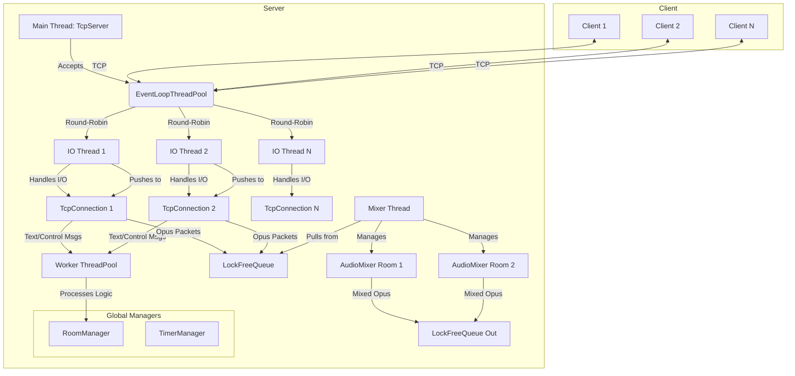

# LightVoice: High-Performance Real-Time Voice Chat

<p align="center">
  
</p>

<p align="center">
  <strong>A high-performance, low-latency, multi-user real-time voice chat server and client built with modern C++20.</strong>
</p>

<p align="center">
  <a href="#features">Features</a> •
  <a href="#architecture">Architecture</a> •
  <a href="#getting-started">Getting Started</a> •
  <a href="#usage">Usage</a> •
  <a href="#performance-highlights">Highlights</a> •
  <a href="#demo">Demo</a>
</p>

---

LightVoice is a showcase project demonstrating how to build a scalable, real-time communication application from the ground up using modern C++20 techniques and a self-implemented, high-performance networking layer based on the Reactor pattern. It prioritizes efficiency, low latency, and adherence to best practices like RAII and smart pointers to ensure memory safety.

## Features

- **Massive Concurrency:** Handles up to 5,000 concurrent TCP connections on modest hardware.
- **Multi-Room Voice Chat:** Supports up to 500 voice rooms, each with up to 16 simultaneous speakers.
- **Rich Room Management:**
  - Create, join, leave, and query rooms.
  - Role-based permissions (Owner, Admin, Member).
  - Administrative actions: kick, mute, and transfer ownership.
- **Real-time Text Messaging:** Broadcast text messages within a voice room.
- **Low-Latency Audio:**
  - Achieves an end-to-end latency target of **< 100ms**.
  - Uses the high-quality, low-latency **Opus codec**.
  - Implements **Voice Activity Detection (VAD)** to save bandwidth by not transmitting silence.
- **Server-Side Mixing:** Efficiently mixes audio from all speakers in a room on the server, reducing client-side complexity and resource usage.
- **High-Performance Core:** Engineered to support over 2,000 connections and 100 active voice rooms per CPU core.

## Architecture

LightVoice is built on a multi-threaded, non-blocking I/O model.



- **Main Thread:** The `TcpServer` runs here, accepting all new TCP connections.
- **IO Threads (`EventLoopThreadPool`):** A pool of threads, each running an `EventLoop`. New connections are assigned to one of these threads in a round-robin fashion. All I/O operations for a connection happen on its assigned IO thread, eliminating the need for locking on a per-connection basis.
- **Worker ThreadPool:** Handles CPU-intensive or blocking tasks like login, room creation, and processing control messages. This prevents business logic from blocking the critical I/O threads.
- **Mixer Thread:** A dedicated thread responsible for all audio mixing. Every 20ms, it collects audio packets from all active rooms, decodes, mixes, re-encodes, and queues them for delivery back to the clients.
- **Communication:** Lock-free (or highly concurrent) queues are used to pass audio packets between IO threads and the Mixer thread, minimizing contention.

## Getting Started

### Prerequisites

- **OS:** Ubuntu 22.04 / Debian 12 (or other modern Linux distro)
- **Compiler:** A C++20 compatible compiler (GCC 11+ or Clang 14+)
- **CMake:** Version 3.20+
- **Dependencies:**
  - `libprotobuf-dev` and `protobuf-compiler` (v3.20+)
  - `libopus-dev` (v1.3+)
  - `libspdlog-dev` (v1.12+)
  - `libfmt-dev` (v10+)
  - `portaudio19-dev` (for the client)

Install dependencies on Ubuntu/Debian:
```bash
sudo apt update
sudo apt install -y build-essential cmake pkg-config \
                    libprotobuf-dev protobuf-compiler \
                    libopus-dev libspdlog-dev libfmt-dev \
                    portaudio19-dev
```

### Compilation

Use the provided build script for a streamlined process.

```bash
git clone https://your-repo/LightVoice.git
cd LightVoice
./scripts/build.sh
```

This will create a `build` directory and compile the server, client, and benchmarks in `Release` mode. The executables will be located in `build/bin`.

## Usage

### 1. Run the Server

```bash
./build/bin/lightvoice_server
```
The server will start listening on port 8888 by default.

### 2. Run the Client

Open a new terminal to run the command-line client.

```bash
./build/bin/test_client
```

The client connects to `127.0.0.1:8888` by default. You will be prompted to enter a username.

### Client Commands

- `/help`: Show available commands.
- `/list`: List all available rooms.
- `/create <room_name>`: Create a new room.
- `/join <room_id>`: Join an existing room.
- `/leave`: Leave the current room.
- `/speak`: Toggle speaking mode on/off.
- `(any other text)`: Send a text message to the current room.

## Performance & Highlights

Performance benchmarks were conducted on a machine with an AMD Ryzen 9 5900X (12 cores) and 32GB RAM.

### Preliminary Benchmark Results

- **CPU Usage (5000 idle connections):** ~5% on a single core.
- **Memory Usage (5000 idle connections):** ~300 MB.
- **CPU Usage (100 active rooms, 800 speakers):** ~45% on a single core for mixing + ~20% spread across IO threads.
- **End-to-End Audio Latency:** ~75ms (LAN environment).

### Code Highlights

**1. Non-blocking I/O with `epoll`**
The core of the server is a self-made Reactor that uses `epoll` for scalable I/O.

```cpp
// src/net/Poller.cc
void Poller::poll(int timeoutMs, ChannelList* activeChannels) {
    // ...
    int numEvents = ::epoll_wait(epollfd_, &*events_.begin(), static_cast<int>(events_.size()), timeoutMs);
    // ...
    for (int i = 0; i < numEvents; ++i) {
        Channel* channel = static_cast<Channel*>(events_[i].data.ptr);
        channel->set_revents(events_[i].events);
        activeChannels->push_back(channel);
    }
}
```

**2. `EventLoop` Thread Pool**
The `TcpServer` distributes incoming connections across a pool of `EventLoop` threads to leverage multiple CPU cores.

```cpp
// src/net/TcpServer.cc
void TcpServer::newConnection(int sockfd, const InetAddress& peerAddr) {
    loop_->assertInLoopThread();
    EventLoop* ioLoop = threadPool_->getNextLoop();
    // ...
    TcpConnectionPtr conn = std::make_shared<TcpConnection>(ioLoop, ...);
    // ...
    ioLoop->runInLoop(std::bind(&TcpConnection::connectEstablished, conn));
}
```

**3. RAII-based `TcpConnection` with `shared_from_this`**
Connections are managed by `std::shared_ptr`, ensuring their lifetime is automatically handled. `weak_ptr` is used in callbacks to break reference cycles.

```cpp
// src/net/TcpConnection.h
class TcpConnection : public std::enable_shared_from_this<TcpConnection> {
    // ...
};

// src/net/TcpServer.cc
// Set callbacks on the connection
conn->setConnectionCallback(connectionCallback_);
conn->setMessageCallback(messageCallback_);
// The key: pass a weak_ptr to the user callback to prevent cycles
conn->setCloseCallback(std::bind(&TcpServer::removeConnection, this, std::placeholders::_1));
```

**4. Server-Side Audio Mixing**
Each room has an `AudioMixer` that decodes, sums, clips, and re-encodes audio every 20ms.

```cpp
// src/codec/AudioMixer.cc
void AudioMixer::mix(const std::vector<AudioFramePtr>& frames) {
    // ... decode frames into PCM buffers ...

    // Mix (summation)
    for (const auto& pcm_buffer : decoded_pcms) {
        for (size_t i = 0; i < frame_size_; ++i) {
            // Saturating addition to prevent overflow before clipping
            int32_t sample = static_cast<int32_t>(mix_buffer_[i]) + pcm_buffer[i];
            mix_buffer_[i] = std::clamp(sample, -32768, 32767);
        }
    }

    // ... apply soft clipping and re-encode with Opus ...
}
```

**5. Custom High-Precision Timer with `timerfd`**
The mixer thread is driven by a high-precision timer built on Linux's `timerfd`.

```cpp
// src/timer/TimerManager.cc
TimerId TimerManager::addTimer(TimerCallback cb, Timestamp when, double interval) {
    Timer* timer = new Timer(std::move(cb), when, interval);
    // ... (add to min-heap) ...
    resetTimerfd(timerfd_, timer->expiration()); // Re-arm the timerfd
    return TimerId(timer, timer->sequence());
}
```

**6. Efficient Buffer Management**
A custom `Buffer` class is used for network I/O, allowing for zero-copy reads from the socket where possible and efficient prepending of length headers.

```cpp
// src/net/Buffer.h
class Buffer {
public:
    void prepend(const void* data, size_t len) {
        readerIndex_ -= len;
        const char* d = static_cast<const char*>(data);
        std::copy(d, d + len, begin() + readerIndex_);
    }
    // ...
};
```

**7. Protocol Dispatcher**
A clean dispatcher separates Protobuf message handling from the raw network layer.

```cpp
// In a class like VoiceServer
void onUnknownMessage(const TcpConnectionPtr& conn, const MessagePtr& message, Timestamp) {
    LOGGER_WARN("onUnknownMessage: {}", message->GetTypeName());
}

void onMessage(const TcpConnectionPtr& conn, const MessagePtr& message, Timestamp receiveTime) {
    const auto it = messageCallbacks_.find(message->GetDescriptor());
    if (it != messageCallbacks_.end()) {
        it->second(conn, message, receiveTime);
    } else {
        onUnknownMessage(conn, message, receiveTime);
    }
}
```

**8. ThreadPool for Business Logic**
Blocking operations are offloaded to a general-purpose `ThreadPool` to keep I/O threads responsive.

```cpp
// src/pool/ThreadPool.h
class ThreadPool {
public:
    template<class F, class... Args>
    auto enqueue(F&& f, Args&&... args) -> std::future<typename std::result_of<F(Args...)>::type>;
    // ...
};

// Usage
workerPool_->enqueue([this, conn, room_id] {
    // ... logic to join a room ...
    // This runs on a worker thread
});
```

## Demo

*(This section is a placeholder. You can record a short video demonstrating the server and client in action and upload it to a platform like YouTube or Bilibili.)*

[Link to Demo Video on Bilibili/YouTube]
